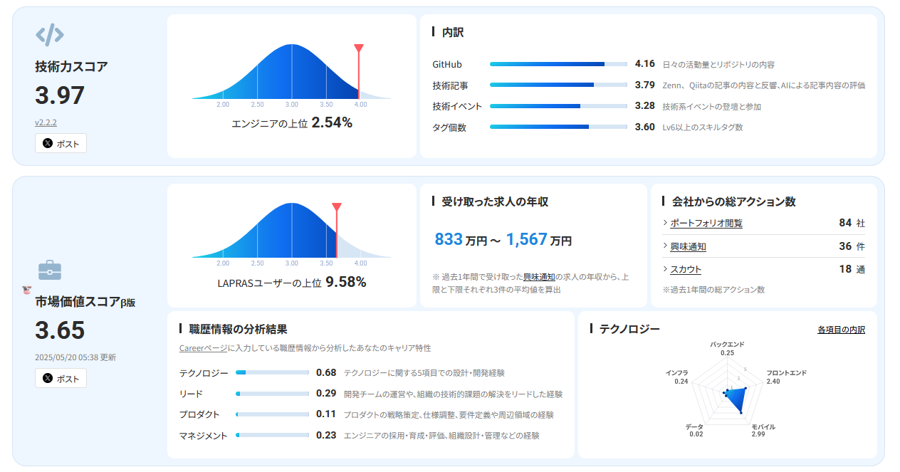
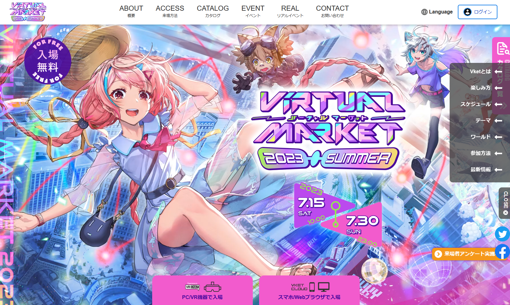
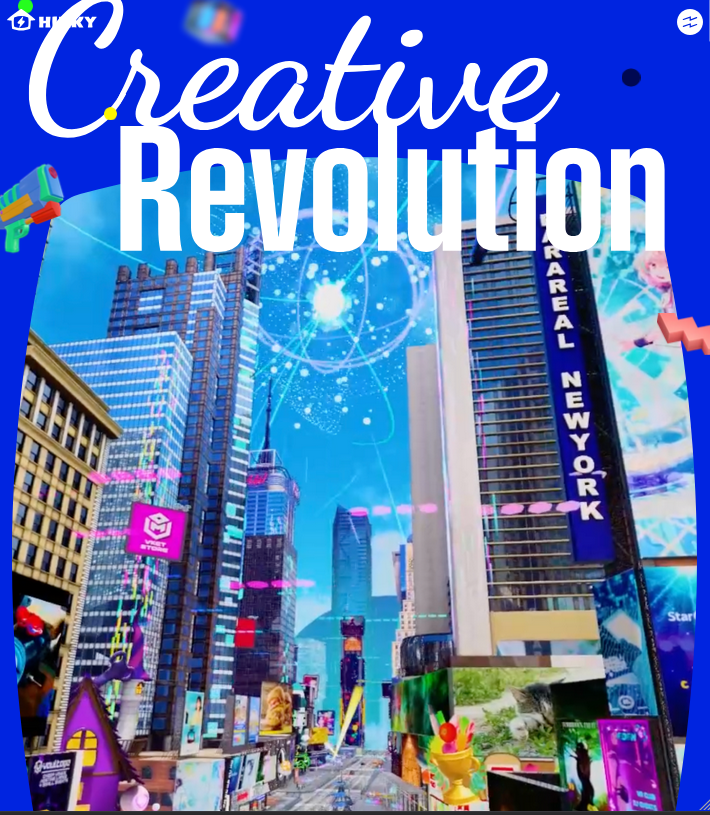
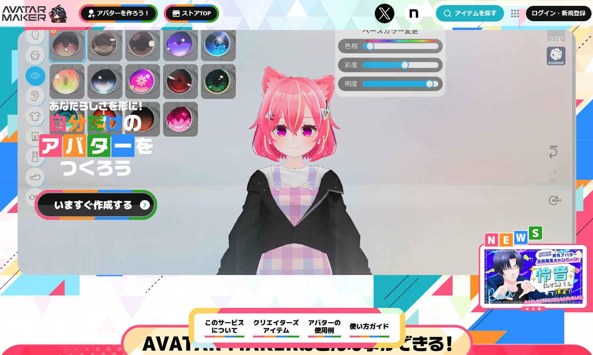
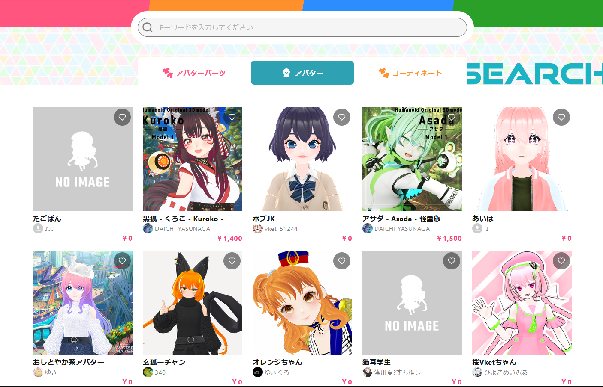
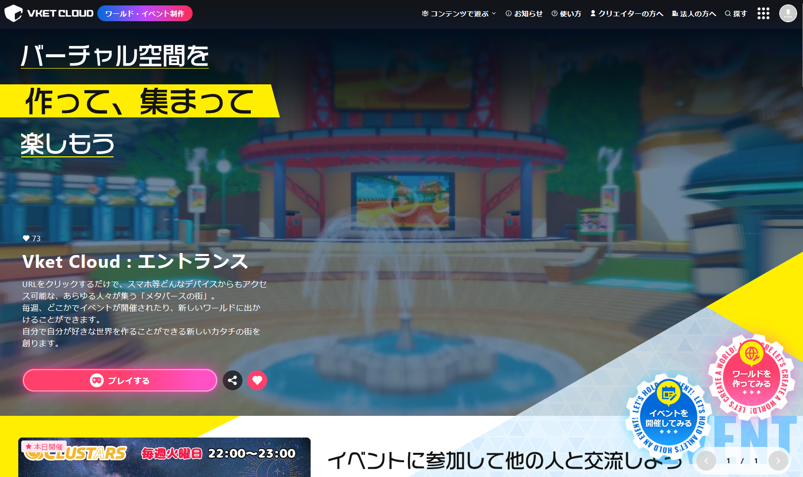

# 📝 履歴書 - aiya000

- **aiya000（あいや）**
- Frontend Engineer / Fullstack Enthusiast / OSS Contributor

**静的型付き言語**・**自動テスト**・**（純粋）関数型プログラミング**・AIの知識を用いて、御社のプロダクトコードの**メンテナンス性**を高く向上させ、開発します。

[](https://lapras.com/public/7H5XCKU)

技術力スコア: 3.97（ITエンジニア全体の**上位2.54%**） -- LAPRAS 技術力スコア v2.2.2 調べ  
市場価値スコア: 3.65（LAPRASユーザーの**上位9.67%**） -- LAPRAS 市場価値スコアβ版 2025/05/23 調べ

|キーワード|
|-|
|**フロントエンド**, 自動テスト, **コード品質**, **メンテナンス性**, 最新技術, 技術トレンド, git, CI/CD|
|**（純粋）関数型プログラミング**, **（強い）静的型付け**, 漸進的型付け, 依存型, 圏論|
|**Test Driven Development**, Property Based Testing, Extensible Effects, モジュラーモノリス|
|**TypeScript**, **Haskell**, C#|
|**Vue**, **Nuxt**, React, Zod, **ESLint**, Bun, Vitest, Playwright, Puppeteer|

- - - - -

<!--
NOTE: doctocが'■'をうまく扱えないので、職務経歴の子セクションの各行を選択して、`:'<,'>s/#\(%E2%96%A0\)\+-/#-`すべし
-->

<!-- START doctoc generated TOC please keep comment here to allow auto update -->
<!-- DON'T EDIT THIS SECTION, INSTEAD RE-RUN doctoc TO UPDATE -->
**Table of Contents**

- [基本情報](#%E5%9F%BA%E6%9C%AC%E6%83%85%E5%A0%B1)
- [その他情報](#%E3%81%9D%E3%81%AE%E4%BB%96%E6%83%85%E5%A0%B1)
- [課外活動](#%E8%AA%B2%E5%A4%96%E6%B4%BB%E5%8B%95)
- [スキル](#%E3%82%B9%E3%82%AD%E3%83%AB)
  - [TypeScript](#typescript)
  - [CSS](#css)
  - [Haskell](#haskell)
  - [Google Cloud Platform](#google-cloud-platform)
  - [その他](#%E3%81%9D%E3%81%AE%E4%BB%96)
- [強み・技能](#%E5%BC%B7%E3%81%BF%E3%83%BB%E6%8A%80%E8%83%BD)
- [自然言語](#%E8%87%AA%E7%84%B6%E8%A8%80%E8%AA%9E)
- [やったことはないが興味があるもの](#%E3%82%84%E3%81%A3%E3%81%9F%E3%81%93%E3%81%A8%E3%81%AF%E3%81%AA%E3%81%84%E3%81%8C%E8%88%88%E5%91%B3%E3%81%8C%E3%81%82%E3%82%8B%E3%82%82%E3%81%AE)
- [職務経歴](#%E8%81%B7%E5%8B%99%E7%B5%8C%E6%AD%B4)
  - [■ N社 : 2014-04 ～ 2016-10](#-n%E7%A4%BE--2014-04--2016-10)
    - [■■ 社用メールサーバーの構築](#-%E7%A4%BE%E7%94%A8%E3%83%A1%E3%83%BC%E3%83%AB%E3%82%B5%E3%83%BC%E3%83%90%E3%83%BC%E3%81%AE%E6%A7%8B%E7%AF%89)
    - [■■ 高校生の研修を引率し、Androidアプリを作成](#-%E9%AB%98%E6%A0%A1%E7%94%9F%E3%81%AE%E7%A0%94%E4%BF%AE%E3%82%92%E5%BC%95%E7%8E%87%E3%81%97android%E3%82%A2%E3%83%97%E3%83%AA%E3%82%92%E4%BD%9C%E6%88%90)
    - [■■ 防水工事現場のマネジメント用Windowsアプリ開発](#-%E9%98%B2%E6%B0%B4%E5%B7%A5%E4%BA%8B%E7%8F%BE%E5%A0%B4%E3%81%AE%E3%83%9E%E3%83%8D%E3%82%B8%E3%83%A1%E3%83%B3%E3%83%88%E7%94%A8windows%E3%82%A2%E3%83%97%E3%83%AA%E9%96%8B%E7%99%BA)
    - [■■ A社設立記念5周年セレモニーで上映するエンディング映像を作成](#-a%E7%A4%BE%E8%A8%AD%E7%AB%8B%E8%A8%98%E5%BF%B55%E5%91%A8%E5%B9%B4%E3%82%BB%E3%83%AC%E3%83%A2%E3%83%8B%E3%83%BC%E3%81%A7%E4%B8%8A%E6%98%A0%E3%81%99%E3%82%8B%E3%82%A8%E3%83%B3%E3%83%87%E3%82%A3%E3%83%B3%E3%82%B0%E6%98%A0%E5%83%8F%E3%82%92%E4%BD%9C%E6%88%90)
    - [■■ 派遣情報管理用Windowsアプリ開発](#-%E6%B4%BE%E9%81%A3%E6%83%85%E5%A0%B1%E7%AE%A1%E7%90%86%E7%94%A8windows%E3%82%A2%E3%83%97%E3%83%AA%E9%96%8B%E7%99%BA)
  - [■ 株式会社イーフロー : 2018-04 ～ 2021-12](#-%E6%A0%AA%E5%BC%8F%E4%BC%9A%E7%A4%BE%E3%82%A4%E3%83%BC%E3%83%95%E3%83%AD%E3%83%BC--2018-04--2021-12)
    - [■■ 某ぬいぐるみロボットの設定ソフトを開発](#-%E6%9F%90%E3%81%AC%E3%81%84%E3%81%90%E3%82%8B%E3%81%BF%E3%83%AD%E3%83%9C%E3%83%83%E3%83%88%E3%81%AE%E8%A8%AD%E5%AE%9A%E3%82%BD%E3%83%95%E3%83%88%E3%82%92%E9%96%8B%E7%99%BA)
    - [■■ 音声加工技術の開発を支援](#-%E9%9F%B3%E5%A3%B0%E5%8A%A0%E5%B7%A5%E6%8A%80%E8%A1%93%E3%81%AE%E9%96%8B%E7%99%BA%E3%82%92%E6%94%AF%E6%8F%B4)
    - [■■ ヘルスケア系iOSアプリの修正](#-%E3%83%98%E3%83%AB%E3%82%B9%E3%82%B1%E3%82%A2%E7%B3%BBios%E3%82%A2%E3%83%97%E3%83%AA%E3%81%AE%E4%BF%AE%E6%AD%A3)
    - [■■ 某社の公式Webサイトをリニューアル](#-%E6%9F%90%E7%A4%BE%E3%81%AE%E5%85%AC%E5%BC%8Fweb%E3%82%B5%E3%82%A4%E3%83%88%E3%82%92%E3%83%AA%E3%83%8B%E3%83%A5%E3%83%BC%E3%82%A2%E3%83%AB)
    - [■■ 社内アプリ開発](#-%E7%A4%BE%E5%86%85%E3%82%A2%E3%83%97%E3%83%AA%E9%96%8B%E7%99%BA)
    - [■■ GitHub周辺開発環境の構築・開発](#-github%E5%91%A8%E8%BE%BA%E9%96%8B%E7%99%BA%E7%92%B0%E5%A2%83%E3%81%AE%E6%A7%8B%E7%AF%89%E3%83%BB%E9%96%8B%E7%99%BA)
    - [■■ Audio Weaver向けPython3ライブラリを開発](#-audio-weaver%E5%90%91%E3%81%91python3%E3%83%A9%E3%82%A4%E3%83%96%E3%83%A9%E3%83%AA%E3%82%92%E9%96%8B%E7%99%BA)
  - [■ 株式会社HIKKY : 2022-01 ～ 2025-05](#-%E6%A0%AA%E5%BC%8F%E4%BC%9A%E7%A4%BEhikky--2022-01--2025-05)
    - [■■ Web部全体向け、Nuxtテンプレートリポジトリの開発・運用・保守](#-web%E9%83%A8%E5%85%A8%E4%BD%93%E5%90%91%E3%81%91nuxt%E3%83%86%E3%83%B3%E3%83%97%E3%83%AC%E3%83%BC%E3%83%88%E3%83%AA%E3%83%9D%E3%82%B8%E3%83%88%E3%83%AA%E3%81%AE%E9%96%8B%E7%99%BA%E3%83%BB%E9%81%8B%E7%94%A8%E3%83%BB%E4%BF%9D%E5%AE%88)
    - [■■ Virtual AKIBA World（VAW）](#-virtual-akiba-worldvaw)
    - [■■ Vket Store](#-vket-store)
    - [■■ Vket 2023 Summer 公式サイト](#-vket-2023-summer-%E5%85%AC%E5%BC%8F%E3%82%B5%E3%82%A4%E3%83%88)
    - [■■ HIKKYコーポレートサイトリニューアル](#-hikky%E3%82%B3%E3%83%BC%E3%83%9D%E3%83%AC%E3%83%BC%E3%83%88%E3%82%B5%E3%82%A4%E3%83%88%E3%83%AA%E3%83%8B%E3%83%A5%E3%83%BC%E3%82%A2%E3%83%AB)
    - [■■ アバターメイカー](#-%E3%82%A2%E3%83%90%E3%82%BF%E3%83%BC%E3%83%A1%E3%82%A4%E3%82%AB%E3%83%BC)
    - [■■ VketCloudのJavaScript向け拡張エンジン](#-vketcloud%E3%81%AEjavascript%E5%90%91%E3%81%91%E6%8B%A1%E5%BC%B5%E3%82%A8%E3%83%B3%E3%82%B8%E3%83%B3)
    - [■■ その他、プロジェクト外での活動](#-%E3%81%9D%E3%81%AE%E4%BB%96%E3%83%97%E3%83%AD%E3%82%B8%E3%82%A7%E3%82%AF%E3%83%88%E5%A4%96%E3%81%A7%E3%81%AE%E6%B4%BB%E5%8B%95)
      - [■■■ その他の技術選定](#-%E3%81%9D%E3%81%AE%E4%BB%96%E3%81%AE%E6%8A%80%E8%A1%93%E9%81%B8%E5%AE%9A)
      - [■■■ 社内での発信](#-%E7%A4%BE%E5%86%85%E3%81%A7%E3%81%AE%E7%99%BA%E4%BF%A1)
- [今後のキャリアの展望](#%E4%BB%8A%E5%BE%8C%E3%81%AE%E3%82%AD%E3%83%A3%E3%83%AA%E3%82%A2%E3%81%AE%E5%B1%95%E6%9C%9B)
- [footnote](#footnote)

<!-- END doctoc generated TOC please keep comment here to allow auto update -->

- - - - -

## 基本情報

|項目|内容|
|:-|:-|
|**Name**|aiya000（あいや）|
|**GitHub**|[aiya000](https://github.com/aiya000)|
|**Portfolio**|[LAPRAS](https://lapras.com/public/7H5XCKU)|
|**Zenn**|[aiya000](https://zenn.dev/aiya000)|
|**Qiita**|[aiya000](https://qiita.com/aiya000)|
|**カジュアル職務経歴書**|[@public\_ai000ya - X bio](https://x.com/public_ai000ya/bio)|

## その他情報

|項目|内容|
|:-|:-|
|X (Twitter)|[@public_ai000ya](https://twitter.com/public_ai000ya)|
|Booth|[galaxy-sixth-sensey](https://aiya000.booth.pm)|
|Blog|[galaxy-sixth-sensey](https://aiya000.github.io)|
|技術書典|[galaxy-sixth-sensey](https://techbookfest.org/organization/5648161435549696)|
|スライド置き場 (reveal.js)|[aiya000.github.io/Maid](https://aiya000.github.io/Maid)|
|スライド置き場 (SlideShare)|[aiya000](https://www.slideshare.net/aiya000)|

## 課外活動

<!-- TODO: （2025-07-04）技術書典の本がなぜか「未出品」or「公開停止あり」になっているので、技術書典運営に問い合わせて、直ったら技術書典の販売ページにリンクする。現在はBoothの方のページにリンクしている -->
<!-- ↑変なものは頒布していないので、内容に関する問題ではないはず -->

| イベント名 | 参加枠 | 発表資料・頒布同人誌 |
|:-:|:-:|:-:|
| [VimConf 2016](https://vimconf.org/2016) | 発表  | [僕の友達を紹介するよ - 僕の開発用プラグイン達](https://aiya000.github.io/Maid/my-vim-friends) |
| [VimConf 2017](https://vimconf.org/2017) | 懇談会LT | [Either Monad in Vim script](https://aiya000.github.io/Maid/either-monad-in-vim-script) |
| [VimConf 2019](https://vimconf.org/2019) | 運営, LT | [Time script - Strong Static Typing with Vim script -](https://aiya000.github.io/Maid/about-time-script) |
| [.vimconf.swp.2018](https://vimconf.connpass.com/event/102292) | 発表 | [僕の推しVimプラグインを見て！](https://aiya000.github.io/Maid/vimconf.swp.2018) |
| [ML Day#2](https://ml-lang.connpass.com/event/94284) | LT | [Haskellで依存型とコンパイル時インラインLisp](https://aiya000.github.io/Maid/lisp-on-haskell-in-compile-time) |
| [Haskell Day 2018](https://haskell-jp.connpass.com/event/92617) | 運営, 発表 | [Semigroupとは？ Monoid？ 環？](https://aiya000.github.io/Maid/haskell-day-2019-deriving) |
| [Haskell Day 2019](https://techplay.jp/event/727059) | 運営, 発表 | [「しんさんきぼう」GHCのderivingテクノロジー](https://aiya000.github.io/Maid/haskell-day-2019-deriving) |
| [Haskell入門ハンズオン！](https://shinjukuhs.connpass.com/event/58224) | メンター | |
| [技術書典5](https://techbookfest.org/event/tbf05/circle/43260001)         | サークル参加 | [矢澤にこ先輩といっしょに代数！](https://aiya000.booth.pm/items/1040121) |
| [技術書典6](https://techbookfest.org/event/tbf06/circle/63720004)         | サークル参加 | [せつラボ ～圏論の基本～](https://aiya000.booth.pm/items/1298622) |
| [技術書典7](https://techbookfest.org/event/tbf07/circle/5762742296248320) | サークル参加 | [せつラボ2～雲と天使と関手圏～](https://aiya000.booth.pm/items/5138923) |

## スキル

- **Haskell**, Scala (2, 3), Kotlin, Elm, [Idris](https://www.idris-lang.org/)
- **TypeScript**, Java, C++ (11, 14, 17), C#, C
- Python3 (mypy), Clojure, bash, zsh, Vim script
- HTML, CSS, Sass, Markdown, Re:VIEW
- json, json5, yaml, GraphQL

### TypeScript

- フレームワーク
    - **Vue**, **Nuxt**
        - Vue3, Nuxt3
            - [@nuxtjs/i18n with yaml in SFC](#example-i18n-with-yaml-in-sfc)
            - [vee-validate](https://vee-validate.logaretm.com/v4/), [vee-validate/zod](https://vee-validate.logaretm.com/v4/integrations/zod-schema-validation/)
            - [vue-test-utils](https://test-utils.vuejs.org/), [vue-testing-library](https://github.com/testing-library/vue-testing-library)
        - Vue2, Nuxt2 (Nuxt.js)
            - typed-vuex, nuxt-property-decorator, vuex, vue-router, vue-property-decorator
        - BootstrapVue, NativeScript-Vue
    - React
        - Next.js
        - Gatsby.js

- ライブラリ
    - [Zod](https://zod.dev/), [openapi-zod-client](https://github.com/astahmer/openapi-zod-client)
    - [type-fest](https://github.com/sindresorhus/type-fest)
    - [probot](https://github.com/probot/probot)
    - [Express.js](https://expressjs.com/ja/)

- エコシステム・ツール
    - Node.js
    - [Bun](https://bun.sh/), [Yarn](https://yarnpkg.com/), [Vite](https://ja.vite.dev/)
    - ESLint, [typescript-eslint](https://typescript-eslint.io/)
    - Prettier, [ESLint Stylistic](https://eslint.style/)

- テスト
    - [Jest](https://jestjs.io/), [Vitest](https://vitest.dev/)
    - [fast-check](https://github.com/dubzzz/fast-check) -- Property Based Testing
    - [Testing Library](https://testing-library.com/)
    - [Playwright](https://playwright.dev/), [Puppeteer](https://pptr.dev/)

### CSS

- Tailwind
- vanilla-extract
- Bootstrap (4, 5)

### Haskell

Haskellでは、多くの言語でライブラリ実装ないし言語仕様での実装がのちにされることになる、多くのComputer Sienceの概念を学びました。

- 主要な成果物
    - [hs-time-script: Time script = Vim script + static typing - GitHub](https://github.com/aiya000/hs-time-script)
    - [hs-zuramaru: Lisp方言ずら〜。え！？ これを使えばQuasiQuotesでコンパイル時Lispが書けるずら！？ - GitHub](https://github.com/aiya000/hs-zuramaru)
    - [haskell\_de_\groupstructure: Haskellでわかる群論の代数的構造 - GitHub](https://github.com/aiya000/haskell_de_groupstructure)
    - [aiya000.github.io-old: 旧ブログ - GitHub](https://github.com/aiya000/aiya000.github.io-old)
    - [その他Haskellのリポジトリ - GitHub](https://github.com/aiya000?tab=repositories&q=hs-&type=&language=&sort=)

- 知識・ライブラリ・言語
    - [**parsec**](https://hackage.haskell.org/package/parsec) -- 他言語から参照される、Parsecの出典。代表的なパーサーコンビネーターライブラリ
        - [megaparsec](https://hackage.haskell.org/package/megaparsec), [trifecta](https://hackage.haskell.org/package/trifecta) -- 直近ではこちらのモダンな実装を使用しました
    - [**QuickCheck**](https://hackage.haskell.org/package/QuickCheck) -- Property Based Testingの出典（原点）であり、他言語からも参照される、代表的なテスティングライブラリ
    - [**lens**](https://hackage.haskell.org/package/lens) -- lens（データ構造への一般的（汎用的）なGetter/Setter）の出典であり、こちらも多言語から参照される、
    - [**Extensible Effects**](https://hackage.haskell.org/package/extensible-effects) -- 同名の概念であるExtensible Effectsの出典
        - [freer-effects](https://hackage.haskell.org/package/freer-effects) -- Extensible Effectsの実用的な実装です
    - [Effect Monad](https://hackage.haskell.org/package/effect-monad) -- {Foo} Effects のひとつ
    - その他ライブラリ
        - profunctors, rio, mtl, Servant, doctest, tasty, smallcheck, hunit
    - 依存型, , メタプログラミング（TemplateHaskell, QuasiQuotes）
    - [各種GHC拡張](https://downloads.haskell.org/ghc/latest/docs/users_guide/exts/table.html)
        - 例:
            - DataKinds, PolyKinds, ConstraintKinds, TypeFamilies, TypeOperators
            - GADTs, ExistentialQuantification, DerivingStrategies, GeneralizedNewtypeDeriving, MultiParamTypeClasses
            - RankNTypes, ScopedTypeVariables, TypeApplications
            - BangPatterns, DuplicateRecordFields, ViewPatterns
            - TemplateHaskell, QuasiQuotes, OverloadedStrings, NamedFieldPuns

- その他
    - [Eta Programming Language - Haskell on the JVM](https://eta-lang.org)
        - [+ JavaFX](https://github.com/aiya000/eta-doromochi)

### [Google Cloud Platform](https://cloud.google.com/products)

- App Engine
- Compute Engine
- Cloud Storage
- Cloud Functions
- Dialogflow
- **Firebase**
    - Firestore
    - Functions
    - Authentication
    - Storage
    - Hosting
    - それぞれのrules

- 少しいじった程度
    - Vision AI
    - Translation
    - Text-to-speech
    - Cloud Domains

### その他

- Kotlin
    - AndroidSDK

- Java
    - AndroidSDK

- C#
    - WPF -- MVVM, MVC
    - Windows Forms
    - Unity
        - VRCSDK3（Avatar, World）
        - [UdonSharp](https://github.com/MerlinVR/UdonSharp)

## 強み・技能

- ☆ **フロントエンド**, フルスタック, プログラミング全般
- ☆ **強い静的型付け**（型検査器）
- ☆ 自動テスト, **コード品質**, **メンテナンス性**
- ☆ 最新技術, 技術トレンド
- ☆ 数学・圏論を少々, 技術書執筆

<!--
NOTE: これ、強いってほど言えるか？ `- アジャイル・スクラム開発`
-->

- 常に**最新の技術・トレンド**を追っている
    - Zenn, Google Discover, Qiita, TechFeed, Reddit, Xなどにより

- **テスト**
    - Test Driven Development (TDD)
    - Property Based Testing
    - [doctest](https://docs.python.org/ja/3.13/library/doctest.html) -- もちろんdoctestが動くならPython以外の言語でも。

- （純粋）関数型プログラミング -- (Pure) Functional Programming
    - Haskell, Idris, Scala (2, 3), Elm, Clojure, (TypeScript)

- **高いコード品質**で開発を遂行できる
    - **強い静的型付け**を駆使したプログラミング
    - 型安全性や仕様未定義などを外れうる言語での**unsafeの回避**, 既に埋め込まれたunsafeの対処と修正
    - 漸進的型付け
    - 最適な関数分割・命名
    - LSPや言語特有のコードフォーマッターを使用
    - 定理証明プログラミング
    - その他、人間的な**可読性の担保**
    - 業務上の理由で書いたコードを破棄することになっても怒りません

- **GitHub**
    - Issue駆動開発（[※1](#what-is-issue-driven-development)）, gitフロー, GitHubフロー, 混合フロー
    - [GitHub Actions](https://github.co.jp/features/actions), GitHub Apps, GitHub Releases

- CSS
    - レスポンシブデザイン

- 数学
    - **圏論**
        - かわいい入門書を頒布中「せつラボ ～圏論の基本～」
            - [紙版 + 電子版](https://aiya000.booth.pm/items/1316747)
            - [電子版オンリー](https://aiya000.booth.pm/items/1298622)
        - 「[圏論の基礎](https://www.maruzen-publishing.co.jp/item/?book_no=294317)」と「[ベーシック圏論](https://www.maruzen-publishing.co.jp/item/?book_no=295027)」を読んでいます
    - 代数的構造
        - かわいい入門書を頒布中「矢澤にこ先輩といっしょに代数！」
            - [紙版 + 電子版](https://aiya000.booth.pm/items/1575006)
            - [電子版オンリー](https://aiya000.booth.pm/items/1040121)
        - [Haskellでわかる群論の代数的構造 - aiya000/haskell_de_groupstructure](https://github.com/aiya000/haskell_de_groupstructure)
            - 資料: [aiya000/hs-algebra: Test algebra type class by QuickCheck.](https://github.com/aiya000/hs-algebra)

- 文章作成
    - **専門書の執筆**（上述）

- プログラミング言語開発・構文解析
    - [Vim script処理系（WIP, RIP）](https://github.com/aiya000/hs-time-script) -- パーサージェネレーター, パーサーコンビネーター
    - [Lisp処理系](https://github.com/aiya000/hs-zuramaru)

## 自然言語

- 日本語
  - ネイティブ

- 英語
  - :o: 書き・読み
  - :x: 聞き・話し

## やったことはないが興味があるもの

- Rust, [Gleam](https://gleam.run/), [PureScript](https://www.purescript.org/)
- WebAssembly
- その他、新しいもの

## 職務経歴

### ■ N社 : 2014-04 ～ 2016-10

- 職務: テックリード, アーキテクト, フルスタック（アプリ, バックエンド, インフラ）, データーベース, QA, 情シス

#### ■■ 社用メールサーバーの構築

初めての業務（インフラ・情シス）です。

全社的に使うインフラ環境を、オンプレミスで構築しました。

- CentOS
    - Redmine
    - [gitbucket](https://github.com/gitbucket/gitbucket)
    - Postfix

#### ■■ 高校生の研修を引率し、Androidアプリを作成

会社の意向で、有志の高校生を募り、研修をすることになりました。
研修内容としてAndroidアプリのチーム開発を発案し、開発リーダーとして引率をしました。

日記アプリを作成しました。

- Java
- AndroidSDK

<details>
<summary>機能要件</summary> <!-- {{{ -->

下記の機能を有していました。

- 日記本文の作成
- 日記への画像挿入

<!-- }}} -->
</details>

#### ■■ 防水工事現場のマネジメント用Windowsアプリ開発

受託開発です。

工事会社からヒアリングをし、外部設計・内部設計・開発も含め、全てを担当しました。

- 担当
    - ヒアリング
    - 外部設計
    - 内部設計
    - 開発（実装）

- 技術スタック
    - C#
    - Windows Forms
    - MySQL

<details>
<summary>機能要件</summary> <!-- {{{ -->

以下の機能を有していました。

- 情報管理
    - 自社社員情報
    - 工事案件の情報
    - 工事材料
    - 工事種（工事材料のグループ）
    - 顧客会社情報

- 「入力・出力」機能
    - 状況 （赤字 or 黒字）の表示
    - 顧客会社への見積書の作成（指定された形式へのExcelへの出力）
    - 日報登録機能 （現場社員による日々のコストの入力）

現場作業員により、経費が入力されます。
その経費を工事現場ごとに集計します。

<!-- }}} -->
</details>

#### ■■ A社設立記念5周年セレモニーで上映するエンディング映像を作成

エンディング映像を表示するためのWebアプリを作成しました。

- 技術スタック
    - AngularJS
    - MVC
    - HTML
    - CSS

<details>
<summary>機能要件</summary> <!-- {{{ -->

下記の機能を持っていました。

- 表示したいテキスト（社員一覧やメッセージなど）を入力する
- 表示したい画像ファイルを入力する
- 上記2つの長さに合わせて、以下を調整し、映像を表示する
    - テキストのスクロールスピード
    - 画像のフェードアウト・表示・フェードインのスピード
    - それらが同時に終了するように、時間を調整する

<!-- }}} -->
</details>

#### ■■ 派遣情報管理用Windowsアプリ開発

派遣情報の管理を行う、Windowsアプリを開発しました。

こちらもヒアリング・外部設計・内部設計・開発（実装）を担当しました。

- 技術スタック
    - C#
    - WPF
    - MVC ※短納期を実現するため、WPFのデフォルトであるMVVMではなく、MVCで設計しました
    - Ruby ※ Excel（派遣の旧資材）とMicrosoft SQL Server周りのスクリプトで使用

---

### ■ 株式会社イーフロー : 2018-04 ～ 2021-12

- 職務: フロントエンド, バックエンド, 低レイヤー（ライブラリ実装）, デスクトップアプリ, モバイルアプリ, CI/CD

#### ■■ 某ぬいぐるみロボットの設定ソフトを開発

本プロジェクトには途中参加しました。

某ホテル会社の店舗に設置する「ぬいぐるみロボット」の挙動を、httpで通信するWindows向けデスクトップアプリを開発しました。

- 技術スタック
    - C#
    - WPF

こちらはメンテナンス性の向上が急務だったため、リファクタリングを担当しました。
特にアーキテクチャが設計されていなかったので、MVVMでコーディングし直しました。

- 技術スタック
    - MVVM

#### ■■ 音声加工技術の開発を支援

某大手企業の音声加工技術のバックエンド開発に携わりました。
主に不具合の調査・自動テスト実装を担当しました。

- 技術スタック
    - C++

不具合の調査では、プログラミング言語マニアとしての能力を用いて、コーダーが仕様を誤解している箇所を多く発見しました。

また、プロダクトの既存のコードのメンテナンス性向上が急務となっていたので、こちらも務めました。

#### ■■ ヘルスケア系iOSアプリの修正

短期間ではありますが、既存のヘルスケア系iOS・Androidアプリの修正を行いました。

- 技術スタック
    - Swift, Xcode
    - Java, AndroidSDK

#### ■■ 某社の公式Webサイトをリニューアル

某社から「公式サイトを一新したい」との依頼を受け、受託開発をしました。

ロジックが全くない、広報用途のサイトであったため、シンプルなCMSとしてJekyllを用いました。
CSSフレームワークにはBootstrapを用いました。

旧公式サイトはPC以外に対応していなかったため、モバイル・タブレット端末へのレスポンシブ対応も行いました。

- 技術スタック
    - Jekyll
    - Bootstrap4
    - レスポンシブデザイン

#### ■■ 社内アプリ開発

Vueの社内採用に先駆けて、Vueの研究目的で、社内アプリ（TODOアプリ）を開発しました。

- 技術スタック
    - Vue2
    - BootstrapVue

<a name="works-github-ci"></a>

#### ■■ GitHub周辺開発環境の構築・開発

某大手企業の開発業務を支援するため、GitHub Actionsを使用した、CI/CD・DevOps環境の構築を行いました。

- 技術スタック
    - TypeScript
        - Node.js
        - probot + octokit
    - GitHub
        - [GitHub Actions](https://github.co.jp/features/actions)
        - GitHub Apps
        - GitHub Templates
        - etc

<details>
<summary>機能要件</summary> <!-- {{{ -->

下記の機能を持っていました。

- GitHub Appsを使用した、GitHub運用の部分的な自動化。例:
    - Organization化の、リポジトリ作成権限を持つユーザーがリポジトリを作成した際、その直後にリポジトリ管理権限を停止する [※2](#corp-e-works-example-a)
    - リポジトリ作成時の、GitHubテンプレートの自動展開 [※3](#corp-e-works-example-b)

<!-- }}} -->
</details>

また、gitに疎い作業者（管理者・プログラマー）のために、本環境のためのgit・GitHub運用マニュアルを作成しました。

- 文章作成

#### ■■ Audio Weaver向けPython3ライブラリを開発

案件としては[前述](#works-github-ci)と同じ扱いですが、別のタスクなので分けて記述します。

Python3から[Audio Weaver](https://w.dspconcepts.com/audio-weaver) Serverにリクエストを投げレスポンスを得るための、非公開ライブラリを作成しました。

- 技術スタック
    - Python3
        - mypy, typing, dataclass, ABC -- 漸進的型付け

---

### ■ 株式会社HIKKY : 2022-01 ～ 2025-05

- 職務: フロントエンドスペシャリスト, CI/CD

HIKKYではCI/CIを除き、Webフロントエンドに集中して従事していたため、Webフロントエンドの技術を今まで以上に深く学ぶことができました。

<a name="hikky-common-tech-stack"></a>

HIKKYではプロジェクトをまたがって技術スタックがほぼ共通していたので、共通部分を以下に示します。

- 全体で共通した技術スタック
    - TypeScript
    - [Bun](https://bun.sh/), [Yarn](https://yarnpkg.com/), [Vite](https://ja.vite.dev/)
    - Vue3, Nuxt3, [@nuxtjs/i18n with yaml in SFC](#example-i18n-with-yaml-in-sfc)
        - [Atomic Design](https://atomicdesign.bradfrost.com/)
    - [Zod](https://zod.dev/), [openapi-zod-client](https://github.com/astahmer/openapi-zod-client)
    - [vee-validate](https://vee-validate.logaretm.com/v4/), [vee-validate/zod](https://vee-validate.logaretm.com/v4/integrations/zod-schema-validation/)
    - ESLint, [typescript-eslint](https://typescript-eslint.io/), Prettier（新しい環境では[ESLint Stylistic](https://eslint.style/)）
    - Vitest（[vue-test-utils](https://test-utils.vuejs.org/), [vue-testing-library](https://github.com/testing-library/vue-testing-library), [fast-check](https://github.com/dubzzz/fast-check)（Property Based Testing））

また、
全てのプロジェクトでIssue駆動開発（[※1](#what-is-issue-driven-development)）が使われていました。

開発はシンプル化されたgitフローが採用されました。  
これはgitフローからreleaseブランチが省かれたもので、
「`main <- develop <- 各featureブランチ`, `main <- 各hotfixブランチ`」のような関係性で、
マージが行われていました。

<a name="hikky-template-repo"></a>

#### ■■ Web部全体向け、Nuxtテンプレートリポジトリの開発・運用・保守

Web部が担当する全てのプロジェクトで使用する、Nuxt製のテンプレートリポジトリの、開発・運用・保守を担当しました。

ひな形をWeb部リーダーが作成していました。  
その後リーダーと相談しながら、他のメンバーとも意見を積極的に交換し、技術選定を主体的に進めていきました。

大きな動きの具体例としては、以下を実行しました。

- JavaScriptにはないTypeScriptのメリットをドキュメント化し、使用を提案
    - その結果、TypeScriptを採用することができました
- `as`や`any`型を用いないこと、Zod・type-festなどを用いることの説明・提案。**型安全性**の啓蒙
- ドキュメントコメントとlanguage-server-protocol（lsp）による、コード例示・コストの低い**ドキュメンテーション**としての、重要性の啓蒙
    - [※コード例](#hikky-example-document-comment)
- **自動テスト**手法の説明・啓蒙
- その他、キャッチした**最新技術**の提案・採用
    - 例:
        - [GitHub Actions](https://github.co.jp/features/actions)
        - [ts-reset](https://github.com/mattpocock/ts-reset)
        - [`<i18n lang="yaml">`](#example-i18n-with-yaml-in-sfc)
        - [openapi-zod-client](https://github.com/astahmer/openapi-zod-client)
        - [Vitest](https://vitest.dev/) （[vue-test-utils](https://test-utils.vuejs.org/), [vue-testing-library](https://github.com/testing-library/vue-testing-library), [playwright](https://playwright.dev/), [fast-check](https://github.com/dubzzz/fast-check)）
        - [ESLint FlatConfig](https://eslint.org/docs/latest/use/configure/migration-guide)

そのうち、内外部向けに公開した記事としては、以下があります。

- 重要なもの（HIKKY内部資料として作成したものを、外部向けに引用したもの）
    - [「テストを書こうとしたけど、どう（いつ）書いたらいいかわからない」初心者向けガイドライン！ - HIKKYフロントエンドガイドラインより](https://zenn.dev/aiya000/articles/00e2795fbb7dee)
    - [単体テストと結合テストガイドライン - HIKKYフロントエンドガイドラインより](https://zenn.dev/aiya000/articles/978fa504b1da3f)
    - [最速TypeScript静的型付け不健全プログラミング～readonlyプロパティに値を再代入する～](https://qiita.com/aiya000/items/65e31b02ca543b7c15df)

<details>
<summary>その他、社内外への共有をしたもの</summary> <!-- {{{ -->

- [zodはどんなときに使えるのか？ ぜんぶだよ！！](https://zenn.dev/aiya000/articles/cd06a0f3620d59)
- [他のプロパティに依存するzodスキーマはsuperRefineを使え](https://zenn.dev/aiya000/articles/5936049dc1ea68)
- [ZodIntersectionのプロパティの和型のうち、いらない型を`.and()`を使って除外する](https://zenn.dev/aiya000/articles/73cdb8721a7637)
- [【型安全な実装】型安全にvue-i18nの辞書から配列を取得して、変数に設定する【の掘り下げ方】](https://zenn.dev/aiya000/articles/d82a34c1f98455)
- [vue-i18nのi18n.t('key')で、'key'が見つからなかったときに例外をthrowする](https://zenn.dev/aiya000/articles/15d1f76e968ea0)
- [【Vue3・Nuxt3】最新のVue3で、`<script setup>`で単に値をexportする（defineExposeではない）](https://zenn.dev/aiya000/articles/f7faffce4eab5d)
- [【Vue3】俺のcomputed(() => x.value)の値が子コンポーネントに勝手にアップデートされるんだが【TypeScript】](https://zenn.dev/aiya000/articles/04288f9fe9bb27)

<!-- }}} -->
</details>

現在はテンプレートリポジトリの外部向けの最新版が、OSSとして以下で公開されています。

- [vket-boilerplate-nuxt](https://github.com/PublicHIKKY/vket-boilerplate-nuxt)

<details>
<summary>本テンプレートリポジトリのアーキテクチャ</summary> <!-- {{{ -->

- Bun Workspaceを用いて、モジュラーモノリスになっています
    - [layers](https://github.com/PublicHIKKY/vket-boilerplate-nuxt/tree/5d6616f053d9f9d0a6422f2c5f0aca360dbc2a46/layers) - 2025-07-05
        - `main` -- プロダクトコードが置かれる想定のレイヤー。テンプレートリポジトリにはプロダクトコードがないため、基本的な環境のみ配置
        - `base` -- 全てのプロダクトの`layers/main`が参照する、共通モジュールを配置するレイヤー
        - その他（現在は`open-api`と`showcases`） -- プロダクトによっては参照することのある、共通モジュールを配置するレイヤー
    - そのため「先にこのテンプレートを使用したプロダクトリポジトリで、`layers/base`にコードを追加」 -> 「プロダクトが落ち着いた時点でテンプレートリポジトリ側にコントリビュートする」という運用が可能になっており、実際にそうしていました

- テストは各レイヤーに配置されています
    - 例: [layers/base/app/test - 2025-07-05](https://github.com/PublicHIKKY/vket-boilerplate-nuxt/tree/5d6616f053d9f9d0a6422f2c5f0aca360dbc2a46/layers/base/app/test)
        - Property Based Testingを使用した例: [array.spec.ts](https://github.com/PublicHIKKY/vket-boilerplate-nuxt/blob/5d6616f053d9f9d0a6422f2c5f0aca360dbc2a46/layers/base/app/test/utils/array.spec.ts)
        - コンパイル時テストを使用した例: [types.spec.ts](https://github.com/PublicHIKKY/vket-boilerplate-nuxt/blob/5d6616f053d9f9d0a6422f2c5f0aca360dbc2a46/layers/base/app/test/utils/types/types.spec.ts)

<!-- }}} -->
</details>

#### ■■ Virtual AKIBA World（VAW）

- フロントエンド担当（ロジック実装, デザイン実装）, CI/CD

JR東日本と協業で、メタバースサービスを開発しました。

私はアウトゲーム（Webフロントエンド）を担当し、Vue/Nuxtを用いて、ロジック実装とデザイン実装を行いました。  
この頃まだHIKKYでの全体的な運用が始まったばかりの[Nuxtテンプレートリポジトリ](#hikky-template-repo)を用いて開発し、その設計思想を学ぶことができました。

またVAWではユーザーからの入力が随所で発生するため、特に入力のバリデーションに力を入れました。

- [Atomic Design](https://atomicdesign.bradfrost.com/)など
- [vee-validate（当時はv3）](https://vee-validate.logaretm.com/v3/)

仕様に忠実に従いつつ、問題がある箇所や改善点を発見していきました。  
Web部内のメンバーおよびプロイジェクトチーム内へ持ち帰り、相談・改善を行いました。  

この結果は、テンプレートリポジトリにも逆輸入する形で、コントリビュートしました。  
逆輸入は強制ではなく任意に任せられますが、私はテンプレートを作成することが好きなので、積極的に行いました。

CI/CDの担当も行いました。  
デプロイ先はAWS LambdaおよびAWS S3で、必要な情報をインフラ担当の方から共有していただき、私は継続的自動デプロイ環境の整備・運用に専念することができました。

本案件でのCI環境は[CircleCI](https://circleci.com/ja/)を採用しました。  
この頃は全社的にCircleCIが採用されていたためです。

なお現在はサービスが終了しており、サービス運用中の様子は以下のリンクにて確認することができます。

- [Virtual AKIBA Worldプロモーションムービー - YouTube](https://www.youtube.com/watch?v=DNWT7LjbeKQ)
- [世界初の「メタバース・ステーション」 “Virtual AKIBA World”がオープンします︕](https://www.jreast.co.jp/press/2021/20220308_ho02.pdf)
- [東京海上日動が JR 東日本のメタバース空間「Virtual AKIBA World」に出展](https://www2.tmn-anshin.co.jp/download/966/221226news.pdf)
- [@v\_akiba\_world（Virtual AKIBA World（VAW）） - X（Twitter）](https://x.com/v_akiba_world)
- [バーチャル空間「Virtual AKIBA World」にてAKB48 SURREALとのタイアップ企画を実施します！ - PR TIMES](https://prtimes.jp/main/html/rd/p/000000399.000041458.html)

#### ■■ Vket Store

- フロントエンド担当（ロジック実装, 一部デザイン実装）

[Vket Store](https://store.vket.com/index.html)にて、同様にフロントエンド・CI/CDを担当しました。

Vket Storeでもユーザーからの入力（商品販売者からの商品登録等）が発生するため、同様に、そして強力なバリデーションが必要でした。  
そこで、Web部全体に啓蒙が浸透し始めていたZodと、vee-validate（v4）を採用しました

vee-validate/zodではシンプルな使用方法として`<Field>`と`<ErrorMessage>`コンポーネントがありますが、
今回はより柔軟なプログラミングが必要だったため、`useField`と`useForm`を使用しました

- [Zod](https://zod.dev/)
- [vee-validate](https://vee-validate.logaretm.com/v4/)
- [vee-validate/zod](https://vee-validate.logaretm.com/v4/integrations/zod-schema-validation/)

本プロジェクトで得た成果も、テンプレートリポジトリに逆輸入としてコントリビュートしました。

なお現在、本サービスは終了しており、以下のリンクで当時の様子を確認することができます。

- [@Vket_Store_（Vket Store ブイケットストア 公式） - X（Twitter）](https://x.com/vket_store_)
- [3Dアバターやアイテムなどを販売できるECサイト「Vket Store」が3月31日にサービス終了へ - MoguLive](https://www.moguravr.com/vket-store-end/)

このプロジェクトの思想は、後述の「[アバターメイカー](#hikky-avatar-maker)」に引き継がれることになります。

#### ■■ Vket 2023 Summer 公式サイト

- フロントエンド担当（ロジック実装）

<div align="center">
    
</div>

[Vket 2023 Summer 公式サイト](https://event.vket.com/2023Summer)にて、サークル参加者向けの管理機能を担当しました。

このプロジェクトの時点で、会社からGitHub Copilotの有料プランのテストとして、私に先行導入させていただきました。  
そしてGitHub Copilotには十分な価値があると判断し、会社への報告をしました。  
その結果、全社的にGitHub Copilot有料プランが導入されることになりました。

またこの段階でGitHub Actionsの啓蒙が完了し、
Web部メンバーに知見が行き渡ったため、
CI/CD環境としてGitHub Actionsを採用しました。

この頃に、自動テストの本格的導入も完了しました。  
各プロジェクトでのテストファースト・テストラストの導入はできなかったものの、
テンプレートリポジトリ（[※a](#hikky-vket2023summer-note1)）での「テストファーストもしくはテストラストを行う」という文化は、
Web部全体に浸透させることができました。

<a name="hikky-vket2023summer-note1">※a</a>: 当時は、今公開されているものの前バージョンで、こちらは非公開です。

#### ■■ HIKKYコーポレートサイトリニューアル

- フロントエンド担当（ロジック実装, 内部設計・実装）

<div align="center" style="display: flex">
    
    
</div>

[HIKKYコーポレートサイト](https://hikky.co.jp/)のリニューアルを行いました。

このプロジェクトではロジックと内部設計（実装）を担当しました。  
この担当では後続のデザイン実装班が作業をしやすいように、
必要なコンポーネントを配置・ロジックのみを記述し、
デザイン実装班は`<template>`の`class`属性と`<style>`を記述するだけで済むようにしました。

デザイン実装班とロジック実装班で分業をする体制について、
またチーム内で分業をする体制について、
どのように動けばいいか、
ノウハウを高めることができました。

<a name="hikky-avatar-maker"></a>

#### ■■ アバターメイカー

- フロントエンド担当（ロジック実装, 一部のデザイン実装）, CI/CD

<div align="center">
    
    
</div>

[アバターメイカー（Avatar Maker）](https://avatarmaker.vket.com/)はVRChat・vrm向けに、
PC・スマホのWebブラウザのみで、
アバターを作成できるサービスです。

このプロジェクトの途中から、
[現行（V2）のNuxtテンプレートリポジトリ](#hikky-template-repo)を使用し始めました。  
移行前にも本プロジェクトの開発は始まっていたため、
既存の成果物の移行をしつつのアップグレードが必要でした。  
私がアップグレードを担当しました。

このサービスは特にインゲームとアウトゲーム・フロントエンドとバックエンドの相互連携が重要だったため、
アウトゲーム・フロントエンド担当として、
他プロジェクトよりもさらに積極的に**コミュニケーション**を撮りました。

また、
そのインゲームとアウトゲームの連携の**アーキテクト**を担当しました。  
ここではNuxtのエコシステム・設計を使用しつつ、
`window`オブジェクトを介したUnityとの連携をすることが必須だったので悩みどころでした。  
そこでVueのcomposablesのオブジェクトが普遍的なデザインであることに着目し、
結果的に、
Unityから使用しても違和感のない設計をすることができました。

<!-- composablesって結局、classの部分集合だと思うんですよね。 -->

バックエンドとフロントエンドのやり取りをするためのモデル層の生成を自動化するために、
[openapi-zod-client](https://github.com/astahmer/openapi-zod-client)の使用を提案しました。  
結果採用され、
git-submodulesと設定ファイルを連携させて、
ワンコマンドで`models/{submodule名/openapi設定ファイル名}.ts`を生成できるように実装しました。

細かいスクリプト類は、
bunスクリプト（`bun run foo.mts`）として記述しました。

このプロジェクトは短納期が求められたため、
負債の発生が多発しました。  
私は**負債の返済（リファクタリング）が得意であり、知見があったため**、
率先してそれを実行しました。  
また**レビュー**でも、
型安全性が遵守されていない・
個人の裁量を超える量で不必要な処理が書かれている・
などを**やんわり**指摘し、
修正を促しました。

このプロジェクトは、少数精鋭の、なんちゃってアジャイル開発で進められました。  
当初はアジャイル開発ではなく、
暗黙的なウォーターフォール開発で進められていましたが、
プロジェクト内で問題提起とアジャイル開発への**移行を提案**し、
アジャイル開発へ移行しました。

#### ■■ VketCloudのJavaScript向け拡張エンジン

- アーキテクト, ライブラリ実装

<div align="center">
    
</div>

[VketCloud](https://cloud.vket.com/)のJavaScript向け拡張エンジン（一般非公開）を開発・運用・保守しました。

VketCloudとはHIKKY製のメタバースプラットフォームです。  
そのインゲームから外界へのやりとりなど、
ブラウザ経由で何かしらを行うための機能を提供するのが、
この拡張エンジン（ライブラリ）でした。  

このライブラリはTypeScriptで記述され、
VketCloud上ではコンパイルされたJavaScriptとして実行されます。

このプロジェクトは技術において、
実に野心的なプロジェクトでした。  
特にアーキテクチャやプログラミングスタイルとして、
以下の特徴が挙げられます。

- 関数型プログラミング
    - ライブラリが使うライブラリとしてコンビネーター（細かい、汎用的な関数）群を定義し、拡張エンジンライブラリ側は全てボイラープレートのみの記述で済む
- TypeScriptの強い静的型付き言語としての利用
    - TypeScriptは漸進的型付けですので、
      通常は強い静的型付けとして扱われません。  
      ですが本プロジェクトでは多くのeslintルールや、
      前述の内側のライブラリへの厳しいレビューをもって、
      強い静的型付けの特徴を引き出しました
    - ジェネリクスの積極的活用（静的に解決できることは実行時に持ち込まない）
    - 関数のカリー化による、型引数（ジェネリクス）の部分適用
    - **`any`と`as`は使わない**

このプロジェクトは少数精鋭の、
前述の「特徴」に挙げられたものに秀でているメンバーによって構成され、
アーキテクチャは継続的に改善されました。

#### ■■ その他、プロジェクト外での活動

##### ■■■ その他の技術選定

技術選定で行った主な技術スタックは[「全体で共通した技術スタック」](#hikky-common-tech-stack)などで述べましたが、
直接の技術スタック以外にも、
以下の技術も啓蒙しました。

その結果、部内全体でこれらが採用されました。

- [GitHub Copilot](https://docs.github.com/ja/copilot)
- [Cline](https://github.com/cline/cline)

これらの啓蒙はHIKKYのボードメンバーに伝わったため、
有料プランへの加入は会社持ちで行われ、
使用を望むメンバーに広く配布されることになりました。

##### ■■■ 社内での発信

HIKKYはプロジェクト外の活動も活発に行っており、私は以下のような活動を行いました。

- Discordの情報共有チャンネルで定期的に、個人的にキャッチした情報を発信
- 上記チャンネルで共有したものをまとめ、Web部の週次定例で発表する時間をいただき、発表

Web部内外への定期的な発信により、会社の技術への興味・関心を向上させました。

- - - - -

## 今後のキャリアの展望

<!-- TODO: もっといい感じに書く。とりあえず今は思いつくことを書いておく -->

フロントエンドエンジニアのスペシャリストとして活動を行っていきます。
時にはテックリードとしても活動していく予定。

その他のプログラミング工程（バックエンド, デスクトップアプリ, モバイルアプリ, CLIツール, etc）も、担当可能です。

インフラエンジニアとしての経験は若干ありますが、今後としてはインフラエンジニアとしての活動は行わず、プログラマーとしてのスペシャリスト、およびテックリードとして活動していこうと思います。

- - - - -
- - - - -

## footnote

<a name="what-is-issue-driven-development">※1</a>: 1つのIssueに対してn（`0 <= n`）個のPRを作成・紐付けを行い、開発を継続していくスタイル。

<a name="corp-e-works-example-a">※2</a>: リポジトリ作成権限を持たせながら、リポジトリ管理権限は持たせたくないため。

<a name="corp-e-works-example-b">※3</a>: [テンプレートリポジトリ](https://docs.github.com/ja/github/creating-cloning-and-archiving-repositories/creating-a-template-repository)を使用することも考えられましたが、リポジトリ作成後はそれぞれのプロジェクトでカスタムしたいとのことでした。

<a name="hikky-example-document-comment">※4</a>: コストの低いドキュメンテーションとしての、ドキュメントコメントでのコード例示。lspで使用する側から表示されることを想定。

array.ts:
```typescript
/**
 * `start`から`stop`までの範囲の、数値の配列を生成します。
 *
 * ```ts
 * range(1, 5) // [1, 2, 3, 4, 5]
 * range(1, 5, 2) // [1, 3, 5]
 * range(5, 1, -1) // [5, 4, 3, 2, 1]
 * ```
 */
export const range = (start: number, stop: number, step = 1) =>
  Array.from({ length: (stop - start) / step + 1 }, (_, i) => start + i * step)
```

main.ts
```typescript
const main = () => {
  // ここで、lspに対応したエディタのカーソルを'range'の上に持っていき、
  // 'range'のドキュメントを引くことで、
  // 上述のドキュメントコメントが表示されます
  console.log(range(1, 5))
};
```

<a name="example-i18n-with-yaml-in-sfc">※5</a>:
Vueの[SFC](https://ja.vuejs.org/guide/scaling-up/sfc)内にて、[@nuxtjs/i18n](https://i18n.nuxtjs.org/)の[`<i18n>`](https://i18n.nuxtjs.org/docs/api/options#customblocks)を用いて、yamlでコンポーネントローカルな辞書を定義する例:

```vue
<i18n lang="yaml">
ja:
  hello: こんにちは

en:
  hello: Hello
</i18n>

<template>
  <p>{{ i18n.t('hello') }}</p>
</template>

<script setup lang="ts">
const i18n = useI18n()
</script>
```
